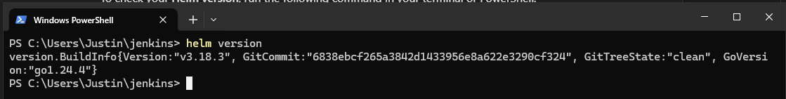
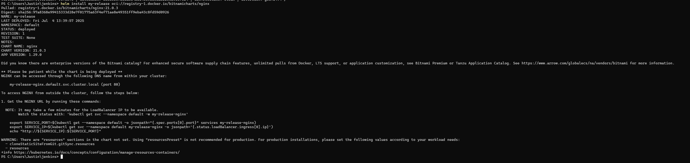
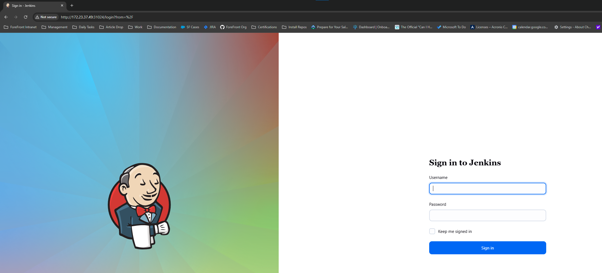
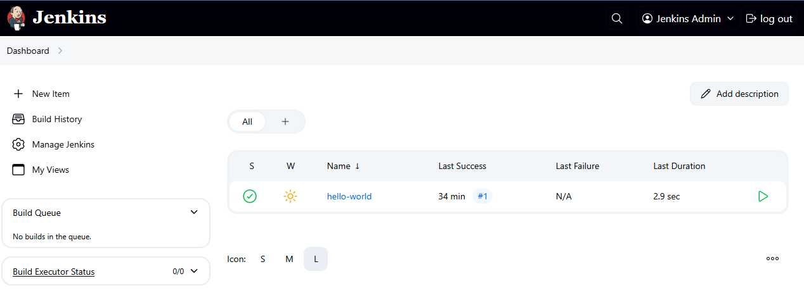
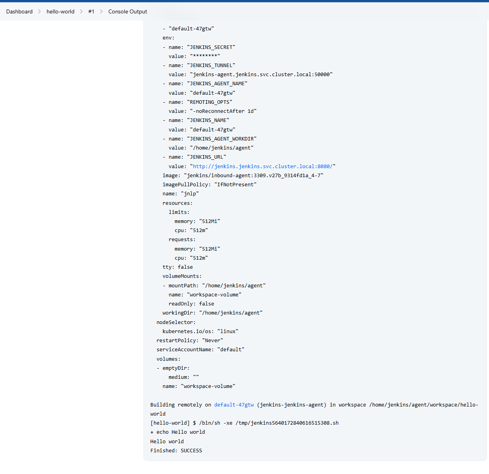
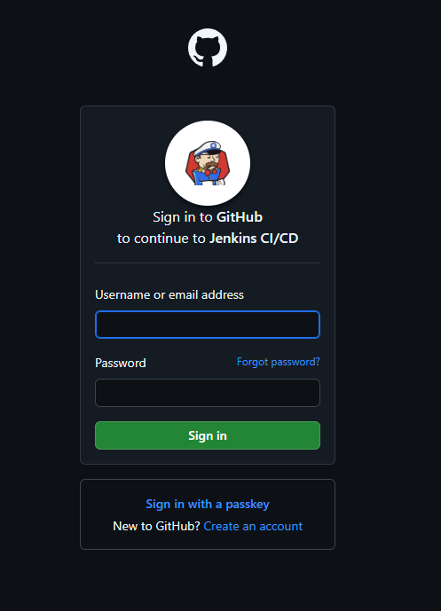

# Task 4: Jenkins Installation and Configuration


## Objective

In order to avoid unnecessary spending, we'll not use cluster we've just created in the AWS. However, we'll leverage [Minikube](https://minikube.sigs.k8s.io/docs/start/?arch=%2Fmacos%2Fx86-64%2Fstable%2Fbinary+download). It's a k8s cluster, which you may install to your local machines. It should be enough for learning purposes. Follow the documentation from that link to install minikube on your local PC. And then, proceed right to [steps](#steps).

If you're brave enough to keep using cluster deployed in the clouds - pay attention on the resource's consumption my your VM. And keep in mind notification down bellow.

IMPORTANT!( for cloud deployment only. Skip this one if you are chose to use minikube) You better choose to use t3/t2.small VMs, since micro have not sufficient amount of RAM for running Jenkins. Be aware that small instances are not included in the free tier, so you'll be charged 0.05$/hour for them.
Best choise for saving - create 1 small instance in public network. Set up an init script to install k3s, and deploy all of the necessary HELM charts to startup jenkins. Destroy environment whenever you are not working with it.

## Steps

1. **Install Helm**

   - Follow the instructions to install [Helm](https://helm.sh/).
      + Installed on Windows using winget `winget install Helm.Helm`
      
   - Verify your Helm installation by deploying and removing the Nginx chart from [Bitnami](https://artifacthub.io/
   packages/helm/bitnami/nginx).
      
2. **Prepare the Cluster**

   - Ensure your cluster has a solution for managing persistent volumes (PV) and persistent volume claims (PVC). Refer to the [K8s documentation](https://kubernetes.io/docs/concepts/storage/volumes/) and [k3s documentation](https://docs.k3s.io/storage) or [Minikube PVC](https://minikube.sigs.k8s.io/docs/handbook/persistent_volumes/)for more details.
      + Create a directory on the minikube node to be used as PV (ssh into node, create directory, and grant ownership to service account)
         ```plaintext
         minikube ssh
                                  _             _
                     _         _ ( )           ( )
           ___ ___  (_)  ___  (_)| |/')  _   _ | |_      __
         /' _ ` _ `\| |/' _ `\| || , <  ( ) ( )| '_`\  /'__`\
         | ( ) ( ) || || ( ) || || |\`\ | (_) || |_) )(  ___/
         (_) (_) (_)(_)(_) (_)(_)(_) (_)`\___/'(_,__/'`\____)

         $ mkdir /data/jenkins-volume
         $ sudo chown -R 1000:1000 /data/jenkins-volume
         ```
      + Get the PV template from Jenkins with:

      [`wget https://raw.githubusercontent.com/jenkins-infra/jenkins.io/master/content/doc/tutorials/kubernetes/installing-jenkins-on-kubernetes/jenkins-01-volume.yaml -O jenkins-01-volume.yaml`](https://raw.githubusercontent.com/jenkins-infra/jenkins.io/master/content/doc/tutorials/kubernetes/installing-jenkins-on-kubernetes/jenkins-01-volume.yaml)
      
      + Apply to the cluster with the command:

      `kubectl apply -f jenkins-01-volume.yaml`

3. **Install Jenkins**

   - Follow the instructions from the [Jenkins documentation](https://www.jenkins.io/doc/book/installing/kubernetes/#install-jenkins-with-helm-v3) to install Jenkins using Helm. Ensure Jenkins is installed in a separate namespace.
     [Debug init container](https://kubernetes.io/docs/tasks/debug/debug-application/debug-init-containers/#accessing-logs-from-init-containers)

      + Setup the Service account
      
         + Get the YAML config template:

      [`wget https://raw.githubusercontent.com/jenkins-infra/jenkins.io/master/content/doc/tutorials/kubernetes/installing-jenkins-on-kubernetes/jenkins-02-sa.yaml -O jenkins-02-sa.yaml`](https://raw.githubusercontent.com/jenkins-infra/jenkins.io/master/content/doc/tutorials/kubernetes/installing-jenkins-on-kubernetes/jenkins-02-sa.yaml)
      
      ```bash
      # Create the namespace
      kubectl create namespace jenkins
      # Get the config template
      wget https://raw.githubusercontent.com/jenkins-infra/jenkins.io/master/content/doc/tutorials/kubernetes/installing-jenkins-on-kubernetes/jenkins-02-sa.yaml -O jenkins-02-sa.yaml
      # Apply to cluster
      kubectl apply -f jenkins-02-sa.yaml
      ```

   - Ensure that Jenkins is accessible via web browser. [Setup reverse proxy](https://www.digitalocean.com/community/tutorials/how-to-configure-nginx-as-a-reverse-proxy-on-ubuntu-22-04) if you are working in the environment behind the bastion host.

      + Not using reverse proxy because setup in Minikube,
         + Basic forwarding to localhost can be done with  `kubectl port-forward svc/jenkins 8080:8080 -n jenkins`
         + Setting Jenkins to use the Node IP for web accessibility:
            ```bash
            $ kubectl edit svc jenkins -n jenkins
            # Modify the config to use "type: NodePort" instead of "type: ClusterIP"
            ... service/jenkins edited
            # Check the port associated with the NodePort 
            $ kubectl get svc -n jenkins
            # In the example:
            ##NAME            TYPE        CLUSTER-IP      EXTERNAL-IP   PORT(S)          AGE
            ##jenkins         NodePort    10.111.75.211   <none>        8080:31024/TCP   9m1s
            ##jenkins-agent   ClusterIP   10.108.45.89    <none>        50000/TCP        9m1s
            # "jenkins" is the webservice, and 31024 is the Port for access
            # Get the IP of the node with the command:
            $ minikube ip
            ... 172.23.37.32
            # Based on the above, the Jenkins webserver is accessible at http://172.23.37.32:31024/login
            ```
        
 


4. **Verify Jenkins Installation**

   - Create a simple freestyle project in Jenkins that writes "Hello world" into the log.
 
 


5. **Additional Tasks💫**
   - Set up a GitHub Actions (GHA) pipeline to deploy Jenkins. (not applicable on minikube installation)
      + Not relevant for this task
   - Configure authentication and security settings for Jenkins.
      + Using [GitHub Authentication Plugin](https://plugins.jenkins.io/github-oauth/) instead of built-in Username/Password
         + This plugin requires the following plugins and plugin dependencies be installed (jenkins.controller.installPlugins):
            - github-oauth  # GitHub Authentication plugin
            - github-api
            - jjwt-api
            - json-path-api
            - token-macro
            - github
            - github-branch-source
            - jquery3-api
            - echarts-api
            - checks-api
            - junit
            - matrix-project
            - plain-credentials
            - matrix-auth
         + In [jenkins-values.yaml](jenkins-values.yaml), find the Controller.JCasC.configScripts section and review the script named "security". 
         + This will use the environment variables in the K8s cluster (made accessible in Controller.containerEnv and Controller.initContainerEnvFrom) to pass the OAuth Id and Secret of the Created GitHub OAuth app. Use the [gh_auth_secrets.sh](gh_auth_secrets.sh) script to pass environment variables the K8s Cluster.
         
         + We can then restrict access based on associated repo access in GH
   - Use JCasC to store your Hello World job.
      + Defining Job using [Job DSL](https://plugins.jenkins.io/job-dsl/) plugin.
      + jenkins.controller.JSCasC.configScripts.job-dsl:
        ```yaml
        jobs:
          - script: |
              job('hello-world') {
                description('A simple job created via Job DSL that prints Hello world.')
                steps {
                  shell('echo Hello world')
                }
              }
        ```
      + 

## Submission

- Create a `task_4` branch from `main` in your repository.
- Provide a PR with the Helm chart for Jenkins deployment.
- Provide a screenshot of the Jenkins freestyle project log showing "Hello world".
- Provide a PR with the GHA pipeline code for Jenkins deployment.
- Attach screenshot with `kubectl get all --all-namespaces` to the PR
- Provide a README file documenting the installation and configuration process.

## Evaluation Criteria (100 points for covering all criteria)

1. **Helm Installation and Verification (10 points)**

   - Helm is installed and verified by deploying the Nginx chart.

2. **Cluster Requirements (10 points)**

   - The cluster has a solution for managing persistent volumes (PV) and persistent volume claims (PVC).

3. **Jenkins Installation (40 points)**

   - Jenkins is installed using Helm in a separate namespace.
   - Jenkins is available from the web browser.

4. **Jenkins Configuration (10 points)**

   - Jenkins configuration is stored on a persistent volume and is not lost when Jenkins' pod is terminated.

5. **Verification (15 points)**

   - A simple Jenkins freestyle project is created and runs successfully, writing "Hello world" into the log.

6. **Additional Tasks (15 points)💫**
   - **GitHub Actions (GHA) Pipeline (5 points)**
     - A GHA pipeline is set up to deploy Jenkins.
   - **Authentication and Security (5 points)**
     - Authentication and security settings are configured for Jenkins.
   - **JCasC is used to describe job in Jenkins (5 points)**
     - "Hello World" job is created via JCasC in HELM chart values.
