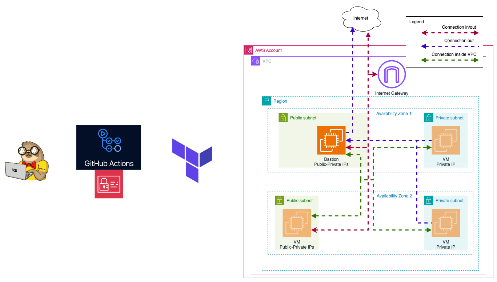
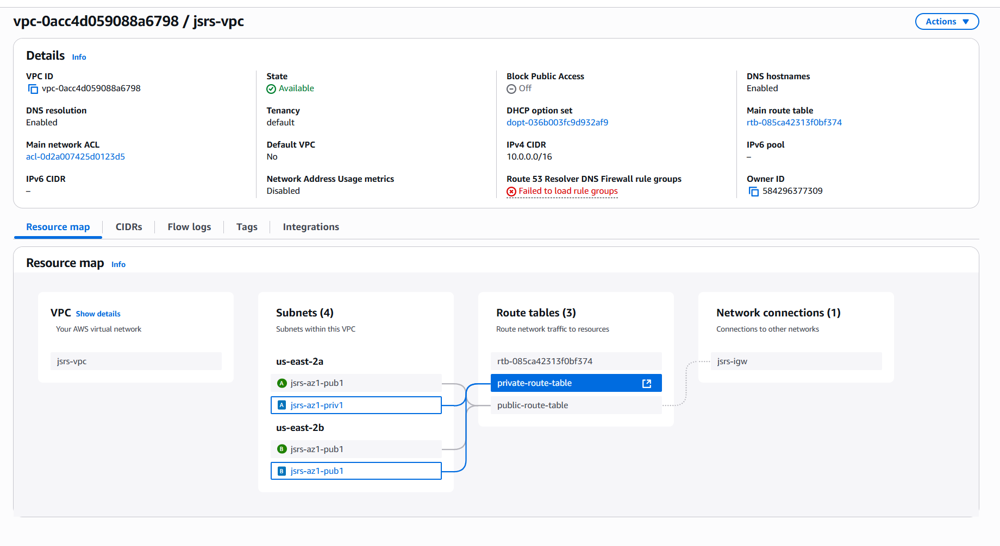

# Terraform for AWS deployments

Deploying CI/CD changes via Terraform configuration files to test Infastructure as Code workflows.

## Terraform files

+ *main.tf* - main class responsible for configuraiton of state file to AWS S3 bucket backend.
+ *variables.tf* - environment specific variables file for aws-region, terraform state, and github OIDC connection.
+ *oidc.tf* - establishes OIDC trust relationship between AWS and GitHub. Only allowed for owner and repo set in variables.
+ *iam-gh_actions_role.tf* - grants FullAccess to core AWS Services to the role used for GitHub Actions OIDC.
+ *s3.tf* - Handles creation of s3 bucket for shared tf state.
+ *dynamodb.tf* - Handles creation of DynamoDB for tf locking.
+ *vpc.tf* - Handles creation of VPC, subnets, IG, and base routing
+ *pub-sg.tf* - Handles creation of Security Group for Public Subnets
+ *priv-sg.tf* - Handles creation of Security Group for Private Subnets
+ *ec2.tf* - Handles creation of underlying EC2 instances and associated routing for Nat Gateway. 
  + **Block Comment out this file to tear-down EC2 instances and budget 750 free-tier hours (handled on local, not in repo)**

## GitHub Actions Files

On push to main branch, GitHub Actions will run based on yml action file in .github/workflows/terraform-deployment.yml to perform the following tasks

1. Perform a terraform format check on the contents of the repo
    + If this action fails with exit code 3, confirm the formatting of your terraform files before commiting. Run the following on your local git prior to push:
    > terraform fmt
2. Run terraform init and plan to compare the config to the state file and describe changes to be made upon apply
3. Run terraform apply to make the changes to the AWS resources.

## AWS information

+ IAM sign-on URL: [https://d-9a6769cb84.awsapps.com/start]
+ MFA required
+ Region = us-east-2

## Network Overview

### VPC CIDR Block
+ 10.0.0.0/16

### Subnet CIDR Block(s)

|  Name:            |  CIDR:           |
|  ---------------- |  --------------- |
|  **az1_pub1**     |  10.0.1.0/24     |
|  **az1_priv1**    |  10.0.2.0/24     |
|  **az2_pub1**     |  10.0.3.0/24     |
|  **az2_priv1**    |  10.0.4.0/24     |

### Routes

+ Public Route Table
  + Default route to AWS Internet Gateway
  + Route VPC subnet to `local`
+ Private Route Table
  + Default route to Elastic Interface of NAT-Gateway
  + Route VPC subnet to `local`

### Security Groups

+ Public Security Group
  + Allow SSH **in** from Home IP Address ONLY (Defined in variables).
  + Allow all VPC private IPs **in** on all protos
  + ALlow all traffic **out** to WAN.
  + Allow all traffic **out** to VPC.
+ Private Security Group
  + Allow all traffic **in** from AZ1 and AZ2 Private subnets
  + Allow SSH **in** from bastion host ip
  + Allow all traffic **out** to WAN
  + Allow all traffic **out** to NAT-GW IP
  + Allow all traffic **out** to AZ1 and AZ2 Private subnets

## EC2 Instances

+ NAT Gateway
  + Subnet: AZ1-PUB1
  + IP: 10.0.1.5
  + Purpose: Perform NAT translation for private subnets to allow traffic out
  + Configuration: Handled with script in user-data field of EC2 Terraform config:
    + Enables IP Forward, Installs IPTables Persistence, apt update/upgrade, enables ip masquerading on firewall, enables and starts nftables.

```bash
#!/bin/bash
echo "net.ipv4.ip_forward = 1" >> /etc/sysctl.conf
sysctl -p

export DEBIAN_FRONTEND=noninteractive
echo iptables-persistent iptables-persistent/autosave_v4 boolean true | debconf-set-selections
echo iptables-persistent iptables-persistent/autosave_v6 boolean false | debconf-set-selections

apt-get update -y
apt-get upgrade -y
apt-get install -y iptables-persistent nftables

iptables -t nat -A POSTROUTING -o enX0 -s 0.0.0.0/0 -j MASQUERADE
netfilter-persistent save
nft list ruleset | tee /etc/nftables.conf > /dev/null

systemctl enable nftables
systemctl start nftables
```

+ Bastion Host
  + Recycling NAT-GW to save on EC2 hours
  + IP: 10.0.1.5
  + EC2 Instance within Public Subnet which has a public IP included in security groups to allow SSH to Private Subnets

+ Private Subnet Instance
  + A test machine to confirm that NAT GW allows traffic to WAN
  + Configuration: Important to manage with aws_key_pair, as EC2 Instance Connect and other forms of on-platform remoting will be more difficult in private IP. Use bastion host to SSH in (must copy SSH private key across to bastion host for auth).

---

## Process Log

## Task 2: Basic Infrastructure Configuration



## Objective

In this task, you will write Terraform code to configure the basic networking infrastructure required for a Kubernetes (K8s) cluster.

## Steps

1. **Write Terraform Code**

   - Create Terraform code to configure the following:
     - VPC
     - 2 public subnets in different AZs
     - 2 private subnets in different AZs
     - Internet Gateway
     - Routing configuration:
       - Instances in all subnets can reach each other
       - Instances in public subnets can reach addresses outside VPC and vice-versa

### Subnet configuration:

|  Name:            |  CIDR:           |
|  ---------------- |  --------------- |
|  **az1_pub1**     |  10.0.1.0/24     |
|  **az1_priv1**    |  10.0.2.0/24     |
|  **az2_pub1**     |  10.0.3.0/24     |
|  **az2_priv1**    |  10.0.4.0/24     |

2. **Organize Code**

   - Define variables in a separate variables file.
   - Separate resources into different files for better organization.

3. **Verify Configuration**

   - Execute `terraform plan` to ensure the configuration is correct.
   - Provide a resource map screenshot (VPC -> Your VPCs -> your_VPC_name -> Resource map).

4. **Additional Tasks💫**
   - Implement security groups.

## Security Groups

### Public Security Group

#### Ingress


#### Egress


### Private Security Group

#### Ingress


#### Egress


   - Create a bastion host for secure access to the private subnets.
     + Re-using ec2 nat-gw for SSH access to private subnet. Private key required for ssh.
   - Organize NAT for private subnets, so instances in the private subnet can connect with the outside world:
     - Simpler way: create a NAT Gateway ❌
     - Cheaper way: configure a NAT instance in the public subnet ✅
   - Document the infrastructure setup and usage in a README file. ✅

## Submission

- Create `task_2` branch from `main` in your repository.
- [Create a Pull Request](https://docs.github.com/en/pull-requests/collaborating-with-pull-requests/proposing-changes-to-your-work-with-pull-requests/creating-a-pull-request) (PR) with the Terraform code in your repository from `task_2` to `main`.
- Provide screenshots of a resource map screenshot (VPC -> Your VPCs -> your_VPC_name -> Resource map) in the PR description.

- (Optional) Set up a GitHub Actions (GHA) pipeline for the Terraform code.

## Evaluation Criteria (100 points for covering all criteria)

1. **Terraform Code Implementation (50 points)**

   - Terraform code is created to configure the following:
     - VPC ✅
     - 2 public subnets in different AZs ✅
     - 2 private subnets in different AZs ✅
     - Internet Gateway ✅
     - Routing configuration: 
       - Instances in all subnets can reach each other
       - Instances in public subnets can reach addresses outside the VPC and vice-versa 

2. **Code Organization (10 points)**

   - Variables are defined in a separate variables file.
   - Resources are separated into different files for better organization.

3. **Verification (10 points)**

   - Terraform plan is executed successfully.
   - A resource map screenshot is provided (VPC -> Your VPCs -> your_VPC_name -> Resource map).

4. **Additional Tasks (30 points)💫**
   - **Security Groups and Network ACLs (5 points)**
     - Implement security groups and network ACLs for the VPC and subnets.
   - **Bastion Host (5 points)**
     - Create a bastion host for secure access to the private subnets.
   - **NAT is implemented for private subnets (10 points)**
     - Orginize NAT for private subnets in a simpler or cheaper way
     - Instances in private subnets should be able to reach addresses outside the VPC
   - **Documentation (5 points)**
     - Document the infrastructure setup and usage in a README file.
   - **Submission (5 points)**
   - A GitHub Actions (GHA) pipeline is set up for the Terraform code.

## References

#### Simpler way

Elastic IP:

- https://docs.aws.amazon.com/AWSEC2/latest/UserGuide/elastic-ip-addresses-eip.html

Route table association:

- https://registry.terraform.io/providers/hashicorp/aws/latest/docs/resources/main_route_table_association

NAT vs Internet Gateway:

- https://stackoverflow.com/questions/74455063/what-exactly-are-nat-gateway-and-internet-gateway-on-aws

Configuration EC2 with private subnets:

- https://medium.com/@prabhupj/terraform-way-to-run-aws-ec2-instances-in-a-private-subnet-and-load-balancing-with-an-application-98da5a11d4f1

#### Cheaper way

Making EC2 a NAT gateway:

- https://medium.com/nerd-for-tech/how-to-turn-an-amazon-linux-2023-ec2-into-a-nat-instance-4568dad1778f

Configuration of NAT with multiple interfaces:

- It is needed to provide an interface by VPC and consume the interface by the Bastion host
- https://people.computing.clemson.edu/~jmarty/courses/LinuxStuff/SetupNATWIthIpTables.pdf
- https://registry.terraform.io/providers/hashicorp/aws/latest/docs/resources/network_interface

iptables:

- https://linux.die.net/man/8/iptables

Logs for troubleshooting user-data:

- https://stackoverflow.com/questions/15904095/how-to-check-whether-my-user-data-passing-to-ec2-instance-is-working
- /var/log/cloud-init.log
- /var/log/cloud-init-output.log