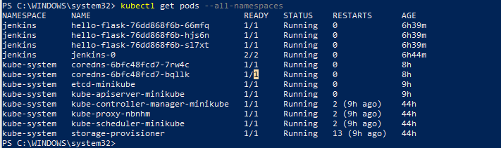

# Task 6: Application Deployment via Jenkins Pipeline


## TLDR
Initialized a CI/CD pipeline in Jenkinsfile with build/test/deploy/integrate steps for the [/flask_app](/flask_app/).

Review the [Solution Outcomes](#solution-outcomes) for the evidence of pipeline for review.

## Basic Infrastructure Configuration

For this task, I am re-using my Application Dockerfile and Helm chart from Task 4 Branch. `flask_app` is the core app directory from [source repo](https://github.com/rolling-scopes-school/tasks/tree/master/devops/flask_app) and `hello-flask` is the helm chart for this app.

I also included the Jenkins configuration used to run this deployment in a .jenkins file. Longterm plan is to add the Pipeline intialization to the JCasC config along with the HelloWorld.

*I may attempt to add a helm chart to deploy the (Cloudlfard Helm Chart)[https://github.com/cloudflare/helm-charts] so I no longer need to depend on NodeIp and can handle Ingress with this proxy. To do this I would probably just capture the full helm chart for jenkins and add cloudflared to the /charts directory.*

```plaintext
├───.jenkins
├───flask_app   
└───hello-flask
    └───templates
```
### Creating a running Jenkins K8s service locally:
I am running on a minikube node for local dev.

1. Going to my [OAuth application for GitHub SSO](https://github.com/settings/applications/3070619) in my Jenkins app setting the `callback url` to the result of `minikube ip` (I later changed this to my public Cloudflare endpoint FQDN).
2. Taking Note of the Client-Id and re-creating a Client-Secret
3. Runnnig the following on my K8s Cluster to create the jenknins namespace and assign secret values to it:

```ps1
# Replace strings with values from step 2
$client_id = "Enter Client ID"
$client_secret = "Enter Client Secret"

kubectl create namespace jenkins

kubectl -- create secret generic github-oauth-secret `
  --from-literal=client-id=$client_id$ `
  --from-literal=client-secret=$client_secret `
  -n jenkins
```

4. Running the following commands to create a provisioned directory in the node to use for the PV

```ps1
minikube ssh
$ mkdir /data/jenkins-volume
$ sudo chown -R 1000:1000 /data/jenkins-volume
```

5. Create the PV and Storage Class with `kubectl apply -f jenkins-01-volume.yaml`
6. Create the standard service accounts with `kubectl apply -f jenkins-02-sa.yaml`
7. Install the Jenkins Helm Chart with configured values from Task_4.
```ps1
$chart=jenkinsci/jenkins
helm install jenkins -n jenkins -f jenkins-values.yaml $chart
```
You can now confirm that Jenkins is running on your cluster's node port by running `minikube ip` and navigating to the http://ip-address:320000


Finally, you will need to run the secret creation shell scripts in the .jenkins repository with your approraite values to enable GitHub SSO and Docker build tasks. See Readme doc in /.jenkins for more info.

### Quickly Serving out the Service Using Cloudfared
Because I am running this from my home computer on non-business internet, I would need some type of Dynamice DNS or Proxy to serve my site publicly for use with GitHub Webhooks. Using webhooks will be critical for triggering the run on repo actions like Push. Webhooks will not send properly to my Private IP, because it is sent from GitHub's services, not my local computer.

To solve for this quickly, I used [CloudFlare Tunnels](https://developers.cloudflare.com/cloudflare-one/connections/connect-networks/). Cloudflare was the best platform for my use case because I already handle Domain management for my domain `justinseaman.com` with Cloudflare. However, you can take other steps to serve publicly i.e. NAT, [Azure AppProxy](https://learn.microsoft.com/en-us/entra/identity/app-proxy/), [EKS LBs](https://docs.aws.amazon.com/eks/latest/best-practices/load-balancing.html) etc. 

1. Sign up for a [Cloudflare Zero Trust](https://developers.cloudflare.com/cloudflare-one/) tenant.
2. [Create a Tunnel](https://developers.cloudflare.com/cloudflare-one/connections/connect-networks/get-started/create-remote-tunnel/) for the Jenkins Applicaiton private IP
3. In the created [application](https://developers.cloudflare.com/cloudflare-one/applications/), define a new [Access Policy](https://developers.cloudflare.com/cloudflare-one/policies/access/) to bypass all access to the site (not require a Cloudlfare Zero Trust User login).


This is essentially an open NAT and HTTPS proxy from http://<private-ip>:320000 to https://<application-url>:443. 

Confirm access by navigating to the Application's URL.

You can restrict the policies and define more granular WAF policies as needed (e.g. only bypass on /webhooks and /securityRealm/finishLogin while forcing ZeroTrust auth on other paths)

### Pipeline Initialization in Jenkins
The Objective of Jenkins Pipeline Configuration is to:
1. Use a Jenkinsfile stored in the git repository to handle Pipeline logic (much like GitHub Actions artifacts are directly associated with repo).
2. Establish Webhook communication from GitHub to Jenkins on key repo events.

#### Manual Steps for GitHub Webhooks Trigger
When building the pipeline, I did the following:
1. Set the following fields on the Pipeline Configure page:
+ **Description:** 
```plaintext
This project will run the following Pipeline steps on every Push to the repo:
   1. Application build
   2. Unit test execution
   3. Security check with SonarQube
   4. Docker image building and pushing to any Registry
   5. Deployment to the K8s cluster with Helm (dependent on the previous step)
   6. (Optional) Application verification (e.g., curl the main page, send requests to API, smoke test)
```
+ **Triggers:** Enable `GitHub hook trigger for GITScm polling`
+ **Pipeline:** Definition = "Pipeline script from SCM"
+ **SCM:** Git
+ **Repository URL**: URL to root of GitHub Repo
+ **Credentials**: Will be generated in following step
+ **Branch Specifier:** Restricted to task_6 with `*/task_6`
+ **Script Path:** Jenkinsfile

2. Create the Jenkins Credential Provider `GitHub App` Credentials by following the [guidance documentation](https://github.com/jenkinsci/github-branch-source-plugin/blob/master/docs/github-app.adoc#creating-the-github-app) for the [GitHub Branch Source](https://plugins.jenkins.io/github-branch-source/) plugin. At it's core, this involves:
   1. Creating a GitHub App
   2. Setting the name, Homepage, and Webhook URLs (https://<jenkins-host>/github-webhook/)
   3. Set the appropriate GitHub permissions for the app
   4. Configure the `Subscribe to events` to list which triggers will launch the application
   5. Make note of the `App ID` and download the generated private key, and convert to a Jenkins readable format using this [OpenSSL](https://openssl-library.org/) command `openssl pkcs8 -topk8 -inform PEM -outform PEM -in key-in-your-downloads-folder.pem -out converted-github-app.pem -nocrypt`
   6. Install the app to the repo using your account.
3. Confirm the Jenkins Server responds with 200 when a webhook is triggered on push in the "Advanced" settings of the GitHub App (you can `Redeliver` webhooks as well).

4. Create a basic Jenkinsfile in the repo with the following content for testing:
```Groovy
def branches = [:]

for (int i = 0; i < 10; i++) {
  def index = i 
  branches["branch${index}"] = {
    node {
      retry(3) {
        checkout scm
      }
      echo "hello world ${index}"
    }
  }
}

retry(3) {
  parallel branches
}
```
5. Check your pipeline on Push for the output of the test Jenkinsfile (should see checkout and run of Jenkinsfile, along with Hello World #0-9).


+ TODO: Create the barbones for this pipeline with a JobDSL script.
+ TODO: Script the creation of the [GitHub App](https://docs.github.com/en/apps/oauth-apps/building-oauth-apps/differences-between-github-apps-and-oauth-apps) for ease of startup in new users/orgs. Overall, much lower lift on future repos as you recylce Credential Provider and simply [authorize for the repo in GitHub](https://docs.github.com/en/rest/apps/installations?apiVersion=2022-11-28#add-a-repository-to-an-app-installation).

### Turning the Jenkinsfile into a CI/CD pipeline

Find the following stages in [Jenkinsfile](./Jenkinsfile)
1. Application build and test
   + Simple build and test that only runs Sonar and later after pass of Unit Tests.
   + Use [pytest](https://docs.pytest.org/en/stable/) to assert a response of 200 at the root of the flask app.
      + Unit tests exist and can be created within [tests](./flask_app/tests/) directory in the app.
      + Uses a sepearte requirements file for unit test packages. `requirements-dev.txt` 
2. Security check with SonarQube
   + Static code analysis with Sonar will use the [Jenkins Plugin](https://github.com/jenkinsci/sonarqube-plugin) and a [Sonar Cloud](https://sonarcloud.io/) free account.
      + Depends on 'SONARQUBE_ENV' configuration in [jenkins-values](./.jenkins/jenkins-values.yaml), particularly JCasC `sonar-cloud-config.yaml`.
      + In my testing I manual created a credential for this and later implemented JCasC to call the secret. May need to comment this JCasC out until you create a Generic credential secret file with the [Sonar Token](https://docs.sonarsource.com/sonarqube-server/10.1/user-guide/user-account/generating-and-using-tokens/) as `sonar-token-id`. 
         + TODO: Implement a Kubectl cluster secret creation for this purpose and pull in with JCasC as this secret.
3. Docker image building and pushing to any Registry
   + Decided to use [kankiko](https://github.com/GoogleContainerTools/kaniko) container to build docker image to avoid issues with DinD. However, kaniko is no longer maintained and may be deprecated in the near future. 
      + TODO: find alternative Docker build and deploy method than kanki. 
4. Deployment to the K8s cluster with Helm (dependent on the previous step)
   + Once Docker image built and published, a Helm build with the same tag should pull it down for CD. For testing purporses, I am building within `jenkins` namespace. Currently the associated NodeIp is set in my cloudflared config for serving [hello-flask](https://hello-flask.justinseaman.com), but may attempt to bundle the cloudlfared workers with some backend tunnel and route configuration with [Terraform](https://developers.cloudflare.com/cloudflare-one/connections/connect-networks/deployment-guides/terraform/).
      + TODO: Implement helm chart to handle creeation of cloudflared pods in the namespace for HTTPS Proxy.
      + TODO: Simultaneously set vars in Terraform for backend configuration of Cloudflare Zero Trust platform.
5. (Optional) Application verification (e.g., curl the main page, send requests to API, smoke test)
   + Quick smoke test to the private IP of the application. `sh 'curl -f https://hello-flask.justinseaman.com/'`

6. Additionally, I configured [Amazon SES](https://aws.amazon.com/ses/) and created secret for username/password for this SMTP connection prior to the creation of [jenkins-values](./.jenkins/jenkins-values.yaml) JCasC `amazon-ses-config.yaml`. See AWS docs on [setting up SMTP on SES](https://docs.aws.amazon.com/ses/latest/dg/send-email-smtp.html) for guidance on token creation.
   + This enables emailext() commands in my post.succes|failure of the pipeline which will trigger email send to my default email address.
      + TODO: Make the secret creation and email address from/to dynamic.

## Solution Outcomes:

+ Passing Pipepline:
   + 
+ SES notification:
   + 
+ Docker Hub Deployment:
   + 
+ Sonar Project:
   + 
+ Helm Deploy:
   + 
+ GitHub Trigger:
   + See [#### Manual Steps for GitHub Webhooks Trigger](#manual-steps-for-github-webhooks-trigger)
## Objective

In this task, you will configure a Jenkins pipeline to deploy your application on a Kubernetes (K8s) cluster. The pipeline will cover the software lifecycle phases of build, testing, and deployment.

## Steps

1. **Configure Jenkins Pipeline**

   - [x] Create a Jenkins pipeline and store it as a Jenkinsfile in your git repository.
   - [x] Configure the pipeline to be triggered on each push event to the repository.

2. **Pipeline Steps**

   - [x] The pipeline should include the following steps:
     1. Application build
     2. Unit test execution
     3. Security check with SonarQube
     4. Docker image building and pushing to any Registry
     5. Deployment to the K8s cluster with Helm (dependent on the previous step)
     6. (Optional) Application verification (e.g., curl the main page, send requests to API, smoke test)

3. **Application verification**
   - [x] Ensure that the pipeline runs successfully and deploys the application to the K8s cluster.
4. **Additional Tasks💫**
   - [x] Set up a notification system to alert on pipeline failures or successes.
   - [x] Document the pipeline setup and deployment process in a README file.

## Submission

- [x] Create a `task_6` branch from `main` in your repository.
- [x] Provide a PR with the application, Helm chart, and Jenkinsfile in a repository.
- [x] Provide a screenshot of passed Jenkins pipeline
- [x] Provide a README file documenting the pipeline setup and deployment process.

## Evaluation Criteria (100 points for covering all criteria)

1. **Pipeline Configuration (40 points)**

   - A Jenkins pipeline is configured and stored as a Jenkinsfile in the main git repository.
   - The pipeline includes the following steps:
     - Application build
     - Unit test execution
     - Security check with SonarQube
     - Docker image building and pushing to ECR (manual trigger)
     - Deployment to K8s cluster with Helm (dependent on the previous step)

2. **Artifact Storage (20 points)**

   - Built artifacts (Dockerfile, Helm chart) are stored in git and ECR (Docker image).

3. **Repository Submission (5 points)**

   - A repository is created with the application, Helm chart, and Jenkinsfile.

4. **Verification (5 points)**

   - The pipeline runs successfully and deploys the application to the K8s cluster.

5. **Additional Tasks (30 points)💫**
   - **Application Verification (10 points)**
     - Application verification is performed (e.g., curl main page, send requests to API, smoke test).
   - **Notification System (10 points)**
     - A notification system is set up to alert on pipeline failures or successes.
   - **Documentation (10 points)**
     - The pipeline setup and deployment process, are documented in a README file.