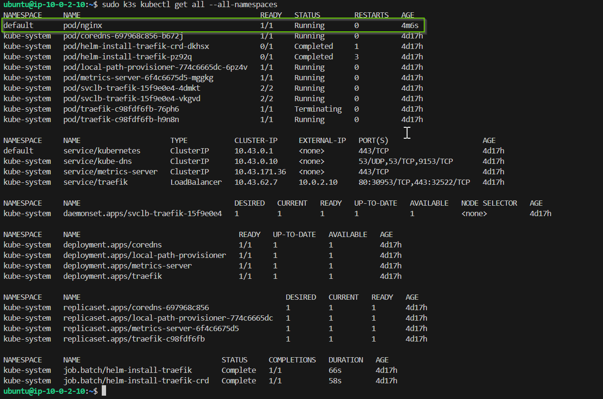

# Terraform for AWS deployments

Deploying CI/CD changes via Terraform configuration files to test Infastructure as Code workflows.

## Terraform files

+ *main.tf* - main class responsible for configuraiton of state file to AWS S3 bucket backend.
+ *variables.tf* - environment specific variables file for aws-region, terraform state, and github OIDC connection.
+ *oidc.tf* - establishes OIDC trust relationship between AWS and GitHub. Only allowed for owner and repo set in variables.
+ *iam-gh_actions_role.tf* - grants FullAccess to core AWS Services to the role used for GitHub Actions OIDC.
+ *s3.tf* - Handles creation of s3 bucket for shared tf state.
+ *dynamodb.tf* - Handles creation of DynamoDB for tf locking.
+ *vpc.tf* - Handles creation of VPC, subnets, IG, and base routing
+ *pub-sg.tf* - Handles creation of Security Group for Public Subnets
+ *priv-sg.tf* - Handles creation of Security Group for Private Subnets
+ *ec2.tf* - Handles creation of underlying EC2 instances and associated routing for Nat Gateway. 
  + **Block Comment out this file to tear-down EC2 instances and budget 750 free-tier hours (handled on local, not in repo)**

## GitHub Actions Files

On push to main branch, GitHub Actions will run based on yml action file in .github/workflows/terraform-deployment.yml to perform the following tasks

1. Perform a terraform format check on the contents of the repo
    + If this action fails with exit code 3, confirm the formatting of your terraform files before commiting. Run the following on your local git prior to push:
    > terraform fmt
2. Run terraform init and plan to compare the config to the state file and describe changes to be made upon apply
3. Run terraform apply to make the changes to the AWS resources.

## AWS information

+ IAM sign-on URL: [https://d-9a6769cb84.awsapps.com/start]
+ MFA required
+ Region = us-east-2

## Kubernetes Cluster Deployment and Setup

### General Design Choices

+ Using AWS RDS running Postgres database as External Database for K3s cluster. This gives us the following benefits over embedded database:
  + Persistence of Cluster state with minimal DB management
  + Easily set and monitor backup plans + potential for S3 db exports programticaly without much code.
  + Resiliant to EC2 tear-downs required to remain in free tier (750 hours over 3 instances minimum gives us about 10 days of service runtime).
    + RDS instance is free for 750 hours is a seperate budget than EC2 (RDS can run 24/7 in a month, while EC2 isntances will come up and down based on need)
  + Able to control master_password state easily with Amazon Systems Manager Parameters (encrypted secrets) and Terraform ephemeral/Write-Only features
+ Use of "iam-ec2-role" assignment grants individual EC2 instances read-access to SSM parameters, so that secrets are not stored in repo, Terraform state, or in User-Data plaintext
  + Instead, root user calls AWS CLI on startup to get parameters and secrets required for Cluster creation script
+ EC2 instances depend upon RDS, and Worker Nodes depend on control plane node in Terraform config, so cluster builds in proper order without risk of race-condition causing failures and manual intervention

### Process

1. Create an RDS instance with (see [rds.tf](rds.tf)):

    + Ephemeral pull from SSM for DB master password (with [password_wo](https://developer.hashicorp.com/terraform/language/v1.11.x/resources/ephemeral#write-only-arguments) to prevent from storing in terraform state file)
    + Currently hard-set to validated Postgres verison of 15.12
    + Set subnet groups (az1/2-priv1) and security groups (private-sg)
    + publicly accessible = false (only private IP assigned)

2. Create the following EC2 instances (see [ec2.tf](ec2.tf)):

      + NAT Gateway + Bastion Host:
        + Configured to allow Private-out and SSH-in
      + K3s Control Plane & K3s Worker(s):
        + Relies on [k3s.tpl](k3s.tpl) and appropraite arguments for cluster building.
          + k3s_token_path   = SSM path of the k3s token variable
          + aws_region       = The AWS region of the ec2 instances
          + control_plane    = Set to "true" if this instance will be control plane, otherwise set to "false".
          + control_plane_ip = Private IP of the Cluster's control plane
          + db_secret_path   = SSM path of the DB Secret
          + node_name        = Some descriptive name for the node (seen in `kubectl get nodes`)
          + db_user          = Username for the DB user of hte cluster
          + db_server        = Private IP of the RDS database
          + db_name          = Name of the Database for K3s on the RDS instance
        + Many of these commands rely on the ability of ec2 to call aws instance (see [ec2.tf](ec2.tf))
          + Needs SSM permissions granted through trust policy to call AWS CLI without passing a core secret.
        + Running the following script on startup with "user-data" field

        ```bash
        #!/bin/bash
        # Create swap disk to mitigate OOM killer
        fallocate -l 1G /swapfile
        chmod 600 /swapfile
        mkswap /swapfile
        swapon /swapfile
        echo '/swapfile swap swap defaults 0 0' | sudo tee -a /etc/fstab

        # Install AWS CLI v2
        apt-get update -y
        apt-get install -y unzip curl
        curl "https://awscli.amazonaws.com/awscli-exe-linux-x86_64.zip" -o "awscliv2.zip"
        unzip awscliv2.zip
        ./aws/install

        # Upgrade packages on AMI
        export DEBIAN_FRONTEND=noninteractive
        apt-get update -y
        apt-get upgrade -y

        # Get K3s Token from SSM
        K3_TOKEN=$(aws ssm get-parameter --name "${k3s_token_path}" --with-decryption --region ${aws_region} --query "Parameter.Value" --output text)

        # If you set "$control_plane" variable to true, then run ctrl-plane command for db connection, otherwise run worker node command to connect to give ctrl-plane
        if [ "${control_plane}" = "true" ]; then
          echo "Running control plane command..."
          # Get DB password from SSM
          DB_PASSWORD=$(aws ssm get-parameter --name "${db_secret_path}" --with-decryption --region ${aws_region} --query "Parameter.Value" --output text)
          # Run k3s cluster build command with appropriate arguments
          curl -sfL https://get.k3s.io | INSTALL_K3S_EXEC="server --token=$${K3_TOKEN} --node-name=${node_name} --datastore-endpoint='postgres://${db_user}:$${DB_PASSWORD}@${db_server}:5432/${db_name}'" sh -
        else
          echo "Running agent node command..."
          # Run k3s worker install command with appropriate arguments
          curl -sfL https://get.k3s.io | INSTALL_K3S_EXEC="agent --node-name=${node_name}" K3S_URL="https://${control_plane_ip}:6443" K3S_TOKEN="$${K3_TOKEN}" sh -
        fi        
        ```

### Accessing the Cluster

1. Copy the Private Key for SSH access to K3s nodes (`scp -i "<path to key>" <path to key> ubuntu@</home/ubuntu/.ssh>`)
2. SSH into bastion host.
3. SSH into `control plane node private ip` with the private key
4. Run kubectl commands, prefixed with `sudo k3s`
  + Can be run without `sudo k3s` if further configuration done, see [this article](https://0to1.nl/post/k3s-kubectl-permission/) 
    + Copy the context to your ~/.kube/config and set this config as the default.
        
        ```bash
        sudo cp /etc/rancher/k3s/k3s.yaml ~/.kube/config && chown $USER ~/.kube/config && chmod 600 ~/.kube/config && export KUBECONFIG=~/.kube/config
        ```
    + You probably want to store that export to your bashrc or bash_profile. After you changed this you can use kubectl in a new terminal.

## Network Overview

### VPC CIDR Block

+ 10.0.0.0/16

### Subnet CIDR Block(s)

|  Name:            |  CIDR:           |
|  ---------------- |  --------------- |
|  **az1_pub1**     |  10.0.1.0/24     |
|  **az1_priv1**    |  10.0.2.0/24     |
|  **az2_pub1**     |  10.0.3.0/24     |
|  **az2_priv1**    |  10.0.4.0/24     |

### Routes

+ Public Route Table
  + Default route to AWS Internet Gateway
  + Route VPC subnet to `local`
+ Private Route Table
  + Default route to Elastic Interface of NAT-Gateway
  + Route VPC subnet to `local`

### Security Groups

+ Public Security Group
  + Allow SSH **in** from Home IP Address ONLY (Defined in variables).
  + Allow all VPC private IPs **in** on all protos
  + ALlow all traffic **out** to WAN.
  + Allow all traffic **out** to VPC.
+ Private Security Group
  + Allow all traffic **in** from AZ1 and AZ2 Private subnets
  + Allow SSH **in** from bastion host ip
  + Allow all traffic **out** to WAN
  + Allow all traffic **out** to NAT-GW IP
  + Allow all traffic **out** to AZ1 and AZ2 Private subnets

## EC2 Instances

+ NAT Gateway
  + Subnet: AZ1-PUB1
  + IP: 10.0.1.5
  + Purpose: Perform NAT translation for private subnets to allow traffic out
  + Configuration: Handled with script in user-data field of EC2 Terraform config:
    + Enables IP Forward, Installs IPTables Persistence, apt update/upgrade, enables ip masquerading on firewall, enables and starts nftables.

```bash
#!/bin/bash
echo "net.ipv4.ip_forward = 1" >> /etc/sysctl.conf
sysctl -p

export DEBIAN_FRONTEND=noninteractive
echo iptables-persistent iptables-persistent/autosave_v4 boolean true | debconf-set-selections
echo iptables-persistent iptables-persistent/autosave_v6 boolean false | debconf-set-selections

apt-get update -y
apt-get upgrade -y
apt-get install -y iptables-persistent nftables

iptables -t nat -A POSTROUTING -o enX0 -s 0.0.0.0/0 -j MASQUERADE
netfilter-persistent save
nft list ruleset | tee /etc/nftables.conf > /dev/null

systemctl enable nftables
systemctl start nftables
```

+ Bastion Host
  + Recycling NAT-GW to save on EC2 hours
  + IP: 10.0.1.5
  + EC2 Instance within Public Subnet which has a public IP included in security groups to allow SSH to Private Subnets

+ Private Subnet Instance
  + A test machine to confirm that NAT GW allows traffic to WAN
  + Configuration: Important to manage with aws_key_pair, as EC2 Instance Connect and other forms of on-platform remoting will be more difficult in private IP. Use bastion host to SSH in (must copy SSH private key across to bastion host for auth).

---

## Process Log

## Task: K8s Cluster Configuration and Creation


## Objective

In this task, you will configure and deploy a Kubernetes (K8s) cluster on AWS using or k3s. You will also verify the cluster by running a simple workload.

## Steps

1. **Choose Deployment Method**

   - Get familiar with [k3s](https://k3s.io/). ✅
   - Use AWS EC2 instances from the [AWS Free Tier](https://aws.amazon.com/free/) to avoid additional expenses. ✅

2. **Create or Extend Terraform Code**

   - Create or extend Terraform code to manage AWS resources required for the cluster creation. ✅
   - Ensure the code includes the creation of a bastion host. ✅

3. **Deploy the Cluster**

   - Deploy [Bastion host](https://www.geeksforgeeks.org/what-is-aws-bastion-host/) ✅
   - Deploy the K8s cluster using k3s. ✅
   - Ensure the cluster is accessible from your bastion host ✅
   - **Additional task** make it accessible from your local computer. 
      + ? Giving the private vpc a public IP? How would this be done in current config, listen on another port for ssh?

4. **Verify the Cluster**

   - Run the `kubectl get nodes` command from your bastion host to get information about the cluster. ✅
   - Provide a screenshot of the `kubectl get nodes` command output. 
    
5. **Deploy a Simple Workload**

   - Deploy a simple workload on the cluster using the following command:
     ```sh 
     kubectl apply -f https://k8s.io/examples/pods/simple-pod.yaml
     ```
   - Ensure the workload runs successfully on the cluster.
    
6. **Additional Tasks💫**
   - Document the cluster setup process in a README file.

## Submission

- Create a `task_3` branch from `main` in your repository. ✅
- Provide a PR with the Terraform code for the K8s cluster and bastion host. ✅
- Provide a screenshot of the `kubectl get all --all-namespaces` command output. (pod named "nginx" should be present)

- Provide a screenshot of the `kubectl get nodes` command output. 2 nodes should be present.

- Provide a README file documenting the cluster setup and deployment process.

## Evaluation Criteria (100 points for covering all criteria)

1. **Terraform Code for AWS Resources (10 points)**

   - Terraform code is created or extended to manage AWS resources required for the cluster creation.
   - The code includes the creation of a bastion host.

2. **Cluster Verification (50 points)**

   - The cluster is verified by running the `kubectl get nodes` command from the bastion host.
   - k8s cluster consists of 2 nodes (may be checked on screenshot).

3. **Workload Deployment (30 points)**

   - A simple workload is deployed on the cluster using `kubectl apply -f https://k8s.io/examples/pods/simple-pod.yaml`.
   - Pod named "nginx" presented in the output of `kubectl get all --all-namespaces` command

4. **Additional Tasks (10 points)💫**
   - **Documentation (5 points)**
     - Document the cluster setup and deployment process in a README file.
   - **Cluster accessability (5 points)**
     - The cluster is verified by running the `kubectl get nodes` command from the **local computer**.